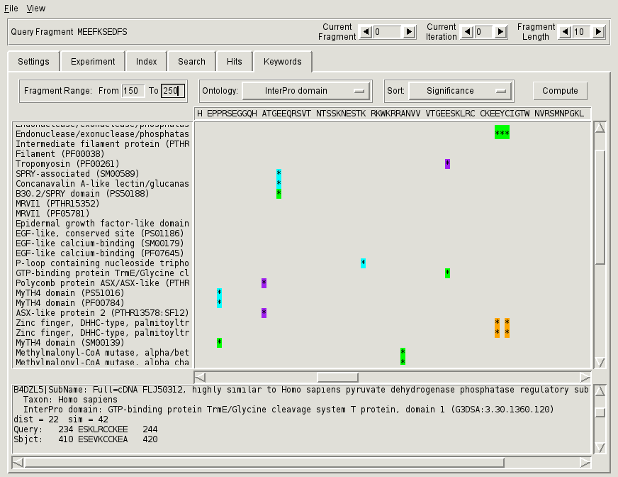

.. _sec-gui-keywords:

Associating search hits with sequence annotations
-------------------------------------------------

The search hits obtained from all queries can be associated with the sequence annotations from the database through the :ref:`fig-pfmfind-keywords` tab.

.. _fig-pfmfind-keywords:

   Keywords tab

The tab consists of an action bar at the top and a viewing panel divided in two parts: the left part shows keywords, while the right shows the fragments associated with those keywords. On the top of the right part is the sequence viewer (current fragment is highlighted yellow). Each association of a keyword with a query fragment is indicated by a ``*`` that is placed on the same lrow as the keyword and in the same column as the first residue of the fragment. The ``*`` marker is highlighted according to the *keyword score*, which is the proportion of the retrieved hits annotated with the keyword out of all hits for that query fragment. The coloring scheme is shown in the table below:

+---------------+--------------------------------------------------------------------+
| Color         | Keyword Score                                                      |
+===============+====================================================================+
| |red|         | less than 0.01                                                     |
+---------------+--------------------------------------------------------------------+
| |orange|      | between 0.01 and 0.05                                              |
+---------------+--------------------------------------------------------------------+
| |yellow|      | between 0.05 and 0.1                                               |
+---------------+--------------------------------------------------------------------+
| |greenyellow| | between 0.1 and 0.2                                                |
+---------------+--------------------------------------------------------------------+
| |green|       | between 0.2 and 0.3                                                |
+---------------+--------------------------------------------------------------------+
| |cyan|        | between 0.3 and 0.4                                                |
+---------------+--------------------------------------------------------------------+
| |blue|        | between 0.4 and 0.5                                                |
+---------------+--------------------------------------------------------------------+
| |purple|      | more than 0.5                                                      |
+---------------+--------------------------------------------------------------------+

To display the keywords associated with retrieved fragments

(1) Select appropriate fragment length and iteration.

(2) Select the range of interest. The computation time and the amount of information shown depends on the selected range so it is better to examine smaller parts of the query sequence one at a time.

(3) Choose *Ontology* (source of annotations) and sorting order using the corresponding pull-down lists.

(4) Click **Compute** to compute a view of the results. Computation may take some time.

Clicking on the ``*`` marker displays the fragment hits associated with that marker in the text box at the bottom of the tab.

.. |red| image:: red.png

.. |orange| image:: orange.png

.. |yellow| image:: yellow.png

.. |green| image:: green.png

.. |blue| image:: blue.png

