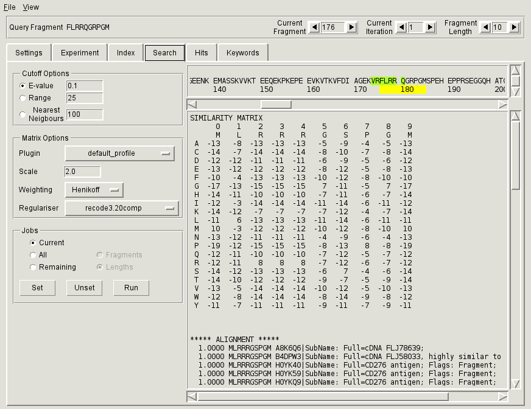

.. _sec-gui-search:

Setting up and running searches
-------------------------------

Fragment based searches for the selected experiment are set up and run through
the :ref:`fig-pfmfind-search`. The searches are first scheduled by setting
*search jobs*, which encapsulate the query sequence and the search parameters,
and then sent to the connected index in batches for execution.

.. _fig-pfmfind-search:

   Search tab

To schedule and perform a search

* Select the appropriate sequence fragment and iteration using the counters
  within the top status bar.
    - *Fragment Length* selects a fragment length between 6 and 20 residues.
    - *Current Iteration* selects an iteration (0 for the initial search,
      1 or more for searches based on the results of previous searches (similar
      to PSI-BLAST).
    - *Current Fragment* selects a particular fragment of a given
      length. Fragments are numbered from 1. An *n*-th fragment consists of
      the *n*-th residue within the query sequence plus the subsequent *m-1*
      residues, where *m* is the specified fragment length.

* Specify search parameters using the *Cutoff Options* and *Matrix Options*
  panels.

* Select and set one or more search jobs through the *Jobs* panel. Click the
  **Set** button to record the jobs.

* Once you have finished selecting jobs, click on **Run** to submit all currently
  scheduled jobs to the index. The **Run** button is disabled while the search
  is running and becomes enabled again once the results are stored in the database.

Matrix options
^^^^^^^^^^^^^^

Cutoff options
^^^^^^^^^^^^^^

Setting jobs
^^^^^^^^^^^^
