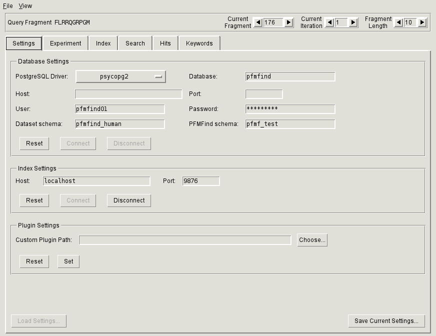

.. _sec-gui-settings:

Entering PFMFind client settings
--------------------------------

Database and index connection settings are entered through the
:ref:`Settings tab<fig-pfmfind-settings>`.

.. _fig-pfmfind-settings:

   Settings tab

Database settings
^^^^^^^^^^^^^^^^^

To establish database connection, enter the same settings that were specfied in the ``PFMFsetupdb.py``
:ref:`configuration file<sec-dbconfig>`. Specifically, attributes of the
`<Database>` tags should give you the entries for *Database*, *Host*, *Port*,
*User* and *Password*.  The *Dataset schema* entry should come from the
`<Schema>` tag attribute. The *PFMFind schema* stores the results of your searches.
It can be set to any identifier: if it does not exist it will be automatically
created. After entering all necessary information, press **Connect** to establish
connection.

Index settings
^^^^^^^^^^^^^^

To connect to an index server, enter its host name and port and click the  **Connect** button. If successful is established,
the **Index** tab will be enabled.

.. note::
   You must establish database connection before connecting to an index. Conversly, when disconnecting, you must first disconnect from the index and then from the database.

Plugin settings
^^^^^^^^^^^^^^^

To specify a directory for additional :ref:`search matrix plugins<sec-search-plugins>`, enter it under *Custom plugin path* and click **Set**.
