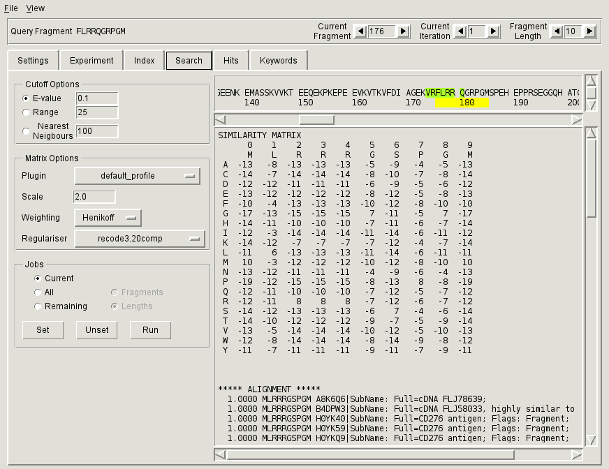

Running GUI client
==================

Starting
--------

The GUI client can be started from the command line using the ``PFMFind.pyw`` script::

  $ PFMFind.pyw [--console] [config_file]

The client will contain a Python console (useful for debugging) if the option ``--console`` is set. The ``config_file`` optional argument is the path to an XML file containing the information about the database and the index to be connected. This file can also be specified directly from the GUI.

GUI workflow
------------

PFMFind GUI allows users to perform searches of protein sequence databases using queries consisting of short fragments with ungapped similarity measures. The fragment length can vary between 6 and 20. The user interface consists of a Menu Bar (with only two options **File** and **View**), a Query Navigation Bar, and the main functional area accessed through six tabs: **Settings**, **Experiment**, **Index**, **Search**, **Hits**, and **Keyword**. If the --console is specified on the command line, an additional **Console** tab containing a Python console appears.

The PFMFind GUI workflow consists of the following steps:

(1) :ref:`sec-gui-settings` (**Settings** tab)

(2) :ref:`sec-gui-expt` (**Experiment** tab)

(3) :ref:`sec-gui-index` (**Index** tab)

(4) :ref:`sec-gui-search` (**Search** tab)

(5) :ref:`sec-gui-hits` (**Hits** tab)

(6) :ref:`sec-gui-keywords` (**Keyword** tab)

When the GUI is started the first time, only the **Settings** tab is enabled. Once the connection to the PostgreSQL database is established, the **Experiment** tab is also enabled. The **Index** tab is enabled when the client connects to a master search index. The final three tabs require the user to set a particular :ref:`experiment <sec-gui-expt>`, in addition to acquiring a database connection. The **Search** tab also requires a connection to an index. In this way, it is possible to examine previous search results without establishing a connection to an index.

.. _sec-gui-settings:

Entering PFMFind client settings
--------------------------------

.. _fig-pfmfind-settings:

.. figure:: pfmfind-gui-settings2.png
   :scale: 100 %
   :alt: PFMFind Settings tab

   Settings tab

.. _sec-gui-expt:

Specifying query sequence
-------------------------

.. _fig-pfmfind-expt:

.. figure:: pfmfind-gui-expt2.png
   :scale: 100 %
   :alt: PFMFind Experiment tab

   Experiment tab

.. _sec-gui-index:

Viewing index information
-------------------------

.. _fig-pfmfind-index:

.. figure:: pfmfind-gui-FSindex2.png
   :scale: 100 %
   :alt: PFMFind Index tab

   Index tab

.. _sec-gui-search:

Setting up and running searches
-------------------------------

.. _fig-pfmfind-search:

   Search tab

.. _sec-gui-hits:

Examining search hits
---------------------

.. _fig-pfmfind-hits:

.. figure:: pfmfind-gui-hits2.png
   :scale: 100 %
   :alt: PFMFind Hits tab

   Hits tab

.. _sec-gui-keywords:

Associating search hits with sequence annotations
-------------------------------------------------

.. _fig-pfmfind-keywords:

.. figure:: pfmfind-gui-keywords2.png
   :scale: 100 %
   :alt: PFMFind Keywords tab

   Keywords tab
