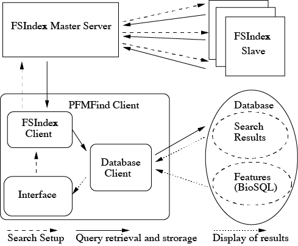

Overview
========

Protein Fragment Motif Finder (PFMFind) is a system written mostly in Python enabling discovery of relationships between short fragments of protein sequences using similarity search. It supports queries based on score matrices and PSSMs obtained through an iterative procedure similar to PSI-BLAST.

PFMFind system consists of three major components (:ref:`fig-pfmfind-system`): a PFMFind GUI (graphical user interface) client, a search engine for fast similarity search of datasets of short peptide fragments called FSIndex and a relational database. PFMFind client takes user input, and communicates with FSIndex and the database through its components. It passes search parameters in batches to FSIndex and receives the results of searches that are then stored in the database. It also retrieves the results from the database and displays them, together with available annotations, to the user. The annotations are stored in a separate BioSQL schema in the database.

PFMFind components communicate using the standard TCP/IP socket interface and can therefore be located on different machines. Since PFMFind is highly modular, the GUI client can be replaced by a Python script for non-interactive use.

.. _fig-pfmfind-system:

   Structure of the PFMFind system.

The PFMFind workflow consists of the following steps

* Setting up a database of protein sequences and their annotations.

* Performing fragment-based searches of the database using query sequences or profiles. The searches are accelerated by using the FSIndex engine.

* Examining search results by associating them with previously-uploaded sequence features (such as domains).

Since the entire search results are stored in a PostgreSQL database, it is also possible to perform additional analyses. However, these are beyond the scope of this manual.
