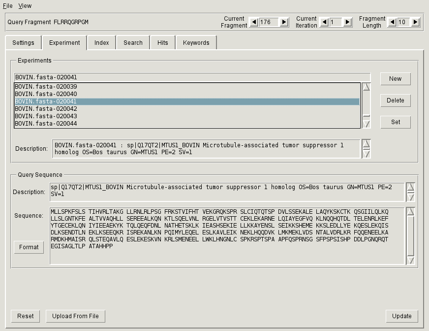

.. _sec-gui-expt:

Specifying query sequence
-------------------------

In PFMFind terminology, an *experiment* consists of an annotated protein sequence that serves as a source of query fragments together with associated search results. Exactly one experiment must be active in order to run searches and examine search results. Experiments are created and set active through the :ref:`Experiment tab<fig-pfmfind-expt>`.

.. _fig-pfmfind-expt:

   Experiment tab

**Experiment** tab consists of two panels: *Experiments* and *Query sequence*. The *Experiments* panel shows all available experiments, while the *Query sequence* panel displays the sequence associated with the current experiment.

Creating a new experiment
^^^^^^^^^^^^^^^^^^^^^^^^^

* Click the **New** button. The boxes for entering data will become enabled.
* Enter
  - Experiment name in the entry field above the list (*Experiments* panel). This will be used to identify experiment in the list.
  - Experiment description in the *Description* box (*Experiments* panel).
  - Sequence description in the *Description* box (*Query sequence* panel).
  - Protein sequence in the *Sequence* box (*Query sequence* panel).
* Click the **Update** button to enter the experiment into the database.

.. note::
   The experiment description can be changed/updated at any time. Hence, it can serve to store the notes about the searches performed. After editing, click the **Update** button to save the changes. The other three fields cannot be changed after they are saved.

Setting the current experiment
^^^^^^^^^^^^^^^^^^^^^^^^^^^^^^

* Select an experiment by highlighting it in the list in the *Experiments* panel.
* Click the **Set** button. The selected experiment will become current.

.. note::
   Pressing the **Set** button when the current experiment is selected in the list unsets the current experiment.

Uploading query sequences as a batch
^^^^^^^^^^^^^^^^^^^^^^^^^^^^^^^^^^^^

* Click **Upload from file** button.
* Select a file in FASTA format.
* PFMFind will automatically construct experiments by uploading all sequences from that file. Experiment names will be formed by concatenating the name of the file and the sequenctial number of the correpsonding protein sequence.

Deleting an experiment
^^^^^^^^^^^^^^^^^^^^^^

Click the **Delete** button. You will get a confirmation dialog.
