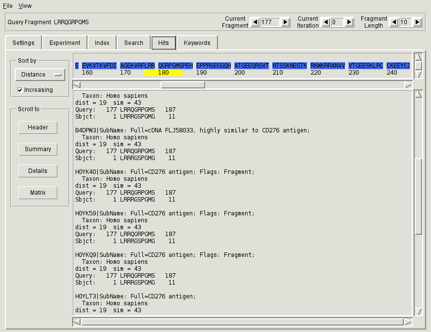

.. _sec-gui-hits:

Examining search hits
---------------------

For each fragment-based query, the retrieved database fragments can be examined
through the :ref:`fig-pfmfind-hits` tab. It consists of the sequence viewer on the top, navigation pannels on the left and the text area on the right that shows the hits in BLAST-like format.

.. _fig-pfmfind-hits:

   Hits tab

The residues in the sequence viewers are highlighted according to the availability of search results.

+-----------------+------------------------------------------------------------------------------------------------------------+
| Color           | Interpretation                                                                                             |
+=================+============================================================================================================+
| |royalblue|     | Results are available for the currently selected fragment length and iteration                             |
+-----------------+------------------------------------------------------------------------------------------------------------+
| |orchid|        | Results are available for a later iteration than selected, for the currently selected fragment length      |
+-----------------+------------------------------------------------------------------------------------------------------------+
| |medturquois|   | Results are available for an earlier iteration than selected, for the currently selected fragment length   |
+-----------------+------------------------------------------------------------------------------------------------------------+
| |medaquamarine| | Results are not available for the currently selected fragment length, but are available for another length |
+-----------------+------------------------------------------------------------------------------------------------------------+

.. |royalblue| image:: royalblue.png

.. |medaquamarine| image:: medaquamarine.png
