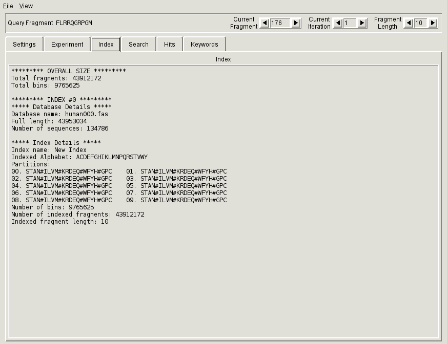

.. _sec-gui-index:

Viewing index information
-------------------------

Once the connection to an index is established, the :ref:`Index tab<fig-pfmfind-index>` provides
information about its structure and size.

.. _fig-pfmfind-index:

   Index tab
