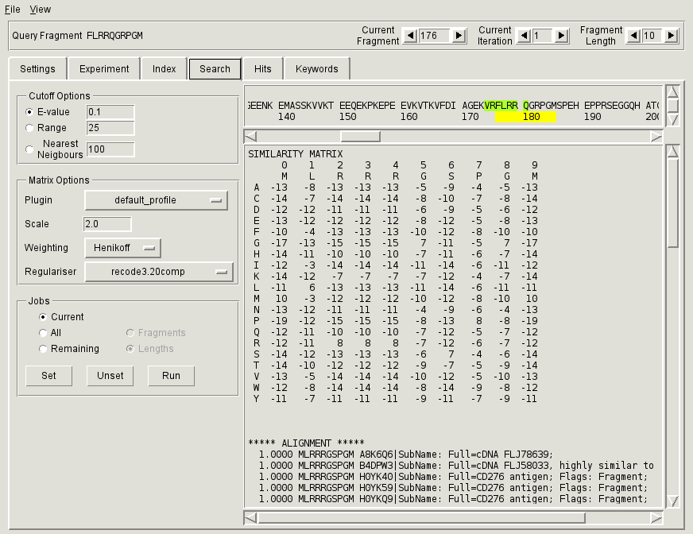

.. _sec-gui-search:

Setting up and running searches
-------------------------------

Fragment based searches for the selected experiment are set up and run through
the :ref:`fig-pfmfind-search`. The searches are first scheduled by setting
*search jobs*, which encapsulate the query sequence and the search parameters,
and then sent to the connected index in batches for execution.

.. _fig-pfmfind-search:

   Search tab

To schedule and perform a search

* Select the appropriate sequence fragment and iteration using the counters
  within the :ref:`Status Bar<subsec-status-bar>`.

* Specify search parameters using the :ref:`Cutoff Options<subsec-cutoff-options>` and :ref:`Matrix Options<subsec-matrix-options>`
  panels.

* Select and set one or more search jobs through the :ref:`Jobs<subsec-setting-jobs>` panel. Click the **Set** button to record the jobs.

* Once you have selected all desired jobs, click on **Run** to submit all currently
  scheduled jobs to the index. The **Run** button is disabled while the search
  is running and becomes enabled again once the results are stored in the database.

.. _subsec-status-bar:

Fragment status bar
^^^^^^^^^^^^^^^^^^^

The status bar at the top of the GUI area (just under Menu bar) allows setting of the current sequence fragment. All operations in **Search**, **Hits** and **Keywords** tab are relative to the current fragment. It contains three counters:

:Fragment Length: selects a fragment length between 6 and 20 residues.

:Current Iteration: selects an iteration (0 for the initial search, 1 or more for searches based on the results of previous searches (similar to PSI-BLAST).

:Current Fragment: selects a particular fragment of a given length. Fragments are numbered from 0. An *n*-th fragment consists of the *n*-th residue within the query sequence plus the subsequent *m-1* residues, where *m* is the specified fragment length.

.. _subsec-matrix-options:

Matrix options
^^^^^^^^^^^^^^

The search matrix is specified through Matrix Options panel and shown in the large text box on the right. Each matrix is obtained through :ref:`sec-search-plugins`. A desired plugin can be chosen from the list of all appropriate available plugins through the *Plugin* pulldown box. PFMFind distinguishes between two types of plugins, one for the first iteration, which does not depend on the results of the previous query, and the other for all subsequent iterations, which may use previous results (see the plugin variable :py:data:`iteration`). If the results of the first iteration (numbered 0) are avalable and you select current iteration to be 1, the contents of the Matrix Options panel will change.

.. _subsec-cutoff-options:

Cutoff options
^^^^^^^^^^^^^^

The criteria for retrieval of fragments from the database are set through Cutoff Options panel. There are three possible options:

* by statistical significance (E-value),

* by range cutoff (Range), and

* by the number of nearest neighbours (Nearest Neighbours).

The range cutoff is relative to the scoring matrix specified under :ref:`Matrix Options<subsec-matrix-options>`. If the supplied matrix is a similarity matrix (this is indicated in the text box), the retrieved fragments will all have similarity with the query greater than or equal to the specified cutoff. If the supplied matrix is a distance matrix, the distance of the retrieved fragments to the query will be less than or equal to the cutoff.

.. _subsec-setting-jobs:

Setting jobs
^^^^^^^^^^^^

The Jobs panel allows setting, unsetting and running searches. A search job can be set for

* The currently selected fragment (*Current* checkbox),

* All fragments (from the query sequence of the current experiment) of the same length as the currently selected fragment (*All* + *Fragment* checkboxes),

* All fragments of all possible lengths (6 to 20) ((*All* + *Lengths* checkboxes),

* Remaining unset fragments of the same length (*Remaining* + *Fragment* checkboxes), and

* Remaining unset fragments of all possible lengths (*Remaining* + *Lengths* checkboxes).

In all cases the jobs are set assuming the currently selected iteration, search matrix and cutoff options.

The current fragment as well as the selected searches are indicated on the sequence viewer located above the matrix viewer text box. The full extent of the current fragment is indicated in yellow (|yellow|) below the sequence. Clicking on a residue in the sequence viewer selects the fragment starting with that residue as current.

The currently set search jobs are indicated by highlighting the sequence (for the current fragment length) or the line above it (for all other fragment lengths). The highlighted residue represents the fragment starting with it.

+---------------+--------------------------------------------------------------------+
| Color         | Interpretation                                                     |
+===============+====================================================================+
| |greenyellow| | Search set for maximum possible iteration (everything OK)          |
+---------------+--------------------------------------------------------------------+
| |royalblue|   | Invalid search set (too high iteration) - ignored                  |
+---------------+--------------------------------------------------------------------+
| |orange|      | Search set for a lower iteration - will overwrite existing results |
+---------------+--------------------------------------------------------------------+

.. |yellow| image:: yellow.png
